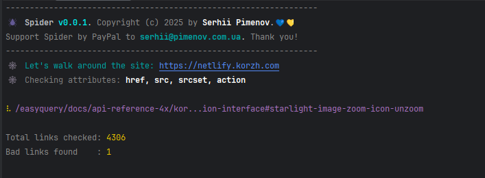

<div align="center">

<h1>Spider</h1>
<div>
Spider is a simple links checker.
With Spider you can check site for broken links and print report to the file.
</div>

---



</div>

## Installation

You can install Spider as a local dependency in your project:

```bash
npm install -D @olton/spider
```

or globally

```bash
npm install -g @olton/spider
```

## Usage

Update your `package.json` file to add a script for checking links:

```json 
{
  "scripts": {
    "check-links": "spider https://site.com"
  }
}
```

Then run the script:

```
npm run check-links
```

### Run from command line

You can run Spider from command line without adding it to `package.json`:

```bash
npx spider https://site.com
```

### Options
You can pass options to Spider:

+ `--verbose` - Run in verbose mode
+ `--attr` - Specify the attributes to check (default: `href, src, srcset, action`)
+ `--help` - Show help
+ `--version` - Show version

```bash
npx spider --attr=href,src https://site.com
```

---
## License

This project is licensed under the MIT License. See the [LICENSE](LICENSE) file for details.

---
## Code Standards

[](https://github.com/standard/standard)

--- 
## Support

If you like this project, please consider supporting it by:

+ Star this repository on GitHub
+ Sponsor this project on GitHub Sponsors
+ **PayPal** to `serhii@pimenov.com.ua`.
+ [**Patreon**](https://www.patreon.com/metroui)
+ [**Buy me a coffee**](https://buymeacoffee.com/pimenov)

---

Copyright (c) 2025 by [Serhii Pimenov](https://pimenov.com.ua)